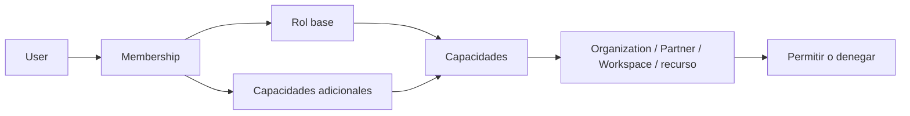

# KYRUMA OS™ — Identity and Authorization

**Estado:** Modelo aprobado; la elección de proveedor de identidad sigue pendiente de RFC.

## Modelo recomendado

Autenticación establece quién es el User. Autorización decide qué puede hacer en un recurso mediante **Membership + capacidades + ámbito**. Los roles son paquetes iniciales de capacidades, no la única regla.

| Rol inicial | Ámbito habitual | Capacidades base orientativas |
| --- | --- | --- |
| Super Admin | Todas las organizaciones | Administración, seguridad, auditoría, acceso de emergencia auditado. |
| Admin | Organization | Gestión de miembros, partners, configuración y datos autorizados. |
| Strategist | Workspace asignado | Discovery, estrategia, reuniones, propuestas e insights. |
| Designer | Workspace asignado | Proyectos, assets, entregables y lectura de contexto necesario. |
| Developer | Workspace asignado | Proyectos, entregables técnicos y documentos autorizados. |
| Partner | Su Organization/Workspace | Lectura y acciones explícitamente compartidas. |
| Viewer | Ámbito limitado | Solo lectura de recursos publicados. |

El catálogo aprobado inicial incluye capacidades por Partner, Workspace, Discovery, Meeting, Proposal, Strategy, Project, Task, Document, Deliverable, Internal Note, Insight, Notification, Audit y Admin. Se implementará como catálogo consolidable, conservando la separación entre lectura, gestión y publicación. Las excepciones se conceden por Membership o recurso, con vencimiento y razón.

## Reglas de aplicación

1. Cada petición autenticada resuelve actor, Membership activa y Organization antes de cargar datos.
2. El servidor aplica autorización; ocultar botones en cliente es solo UX.
3. La decisión combina rol, Membership, Organization, Partner, Workspace, recurso, acción, visibilidad y estado de la relación. Los recursos internos (`InternalNote`, borradores, auditoría) deniegan por defecto a roles Partner/Viewer.
4. Cambios de rol, invitaciones, exportaciones, enlaces públicos y accesos de emergencia generan Audit Event.
5. Las listas, búsquedas y contadores se filtran por ámbito para no revelar existencia de recursos.

## Ciclo de identidad

- Invitación: Admin crea una invitación de un uso, vencimiento y ámbito mínimo; aceptación crea/activa Membership.
- Sesión: cookies seguras, rotación y expiración definidas por proveedor; nunca tokens de larga duración en `localStorage`.
- Recuperación: flujo del proveedor, tasa limitada y auditoría; no revela si existe un correo.
- Revocación: invalida Membership/sesiones según capacidad del proveedor y retira enlaces compartidos derivados.

## Alternativas pendientes

| Alternativa | Ventaja | Riesgo / decisión pendiente |
| --- | --- | --- |
| Proveedor gestionado (Clerk, Auth0, WorkOS u otro) | Menor coste de seguridad de identidad | Coste, residencia y soporte de B2B aún no decididos. |
| Auth.js + proveedor de base de datos | Mayor control y menos dependencia | Más responsabilidad operativa. |
| SSO empresarial desde inicio | Adecuado para clientes grandes | Prematuro antes de conocer demanda. |

**Recomendación:** elegir el proveedor mediante RFC contra el puerto de identidad ya implementado. Un proveedor gestionado sigue siendo una alternativa preferente, pero la elección concreta permanece **pendiente**.
