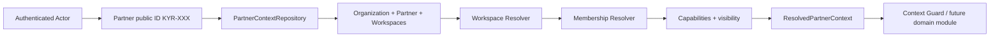

# KYRUMA OS™ — Context Model

## Flujo de resolución

`PartnerContextProvider.resolve(actor, selection)` es la frontera de resolución para dominios posteriores a la creación de Partner. El puerto recibe un `KYR-XXX` validado; la clave técnica permanece dentro del contexto del servidor. `contextKey` es un detalle interno de invalidación y no se serializa ni se usa como autorización.

## Contexto previo a Partner

Lead Lifecycle™ utiliza `DefaultOrganizationContextProvider.resolve(actor, organizationId)` mientras no exista Partner ni Workspace. El resultado, `ResolvedOrganizationContext`, contiene actor, Membership activa, Organization, capacidades efectivas y visibilidades permitidas. No incluye ni simula un Partner o Workspace.

`requireOrganizationContextAccess` aplica el mismo evaluador de Foundation para Capability, Membership, scope y visibilidad. El contexto debe coincidir con la Organization del recurso en cada caso de uso. Tras `PartnerCreated`, un dominio posterior podrá resolver un `ResolvedPartnerContext` sin perder la trazabilidad de la Organization original.

## Ciclo de vida

1. El actor autenticado solicita un Partner por `KYR-XXX`.
2. El repositorio obtiene el registro de contexto sin exponer su clave interna.
3. El Workspace Resolver usa una selección interna explícita, un Workspace principal configurado o un único Workspace; si hay ambigüedad falla de forma segura.
4. El Membership Resolver exige una Membership activa con `partner.read` y `workspace.read` en el mismo ámbito.
5. Se construye un contexto inmutable para el consumidor.
6. El Context Guard vuelve a verificar capacidad, ámbito y visibilidad al ejecutar una acción.

## Reglas de seguridad

- Sin `organizationId` scoped no existe acceso de contexto, salvo Membership de plataforma explícita.
- Partner y Viewer no obtienen recursos `internal`, incluso cuando poseen una capacidad de lectura compartida.
- Partner Context no activa acceso externo: un Workspace `internal` o `external_disabled` solo puede resolverse para personal interno autorizado.
- `contextKey` identifica un contexto para invalidación, no es una credencial ni se expone como autorización.
- Un futuro módulo recibe el contexto ya resuelto; no puede consultar Partner/Workspace/Membership por su cuenta.
- Los recursos pre-Partner se aíslan por `organizationId`; el contexto no concede acceso a una Organization distinta.

## Decisiones pendientes

- Proveedor y modelo de PostgreSQL.
- Identificador público o UX de selección para múltiples Workspaces.
- Fuente de sesión y adaptación de `IdentityProvider`.
- Persistencia y retención de Audit Events de resolución/denegación.
