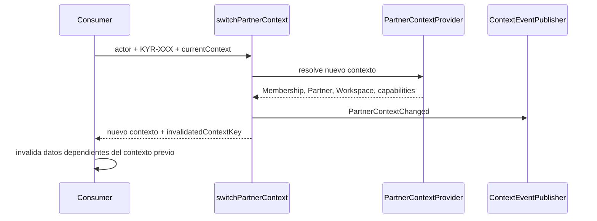

# KYRUMA OS™ — Context Switching

## Contrato

`switchPartnerContext` recibe el actor, una selección de Partner, un provider y el contexto actual opcional. Resuelve de nuevo todos los permisos y devuelve:

```text
context: ResolvedPartnerContext
invalidatedContextKey?: string
```

El consumidor invalida la clave anterior en su caché local/de solicitud y sustituye el contexto. La función no usa almacenamiento global, cookies nuevas ni estado compartido entre usuarios.



## Eventos preparados

| Evento | Productor | Datos mínimos | Consumidores actuales |
| --- | --- | --- | --- |
| `MembershipResolved` | Partner Context Provider | actor, Partner, Workspace | Ninguno. |
| `PartnerContextResolved` | Partner Context Provider | actor, `KYR-XXX`, Workspace | Ninguno. |
| `WorkspaceResolved` | Partner Context Provider | actor, Workspace | Ninguno. |
| `PartnerContextChanged` | Switcher | actor, contexto previo/nuevo | Ninguno. |
| `ContextUnauthorized` | Partner Context Provider | actor, Partner/Workspace, razón mínima | Ninguno. |

Estos son eventos de infraestructura y no sustituyen Timeline, Audit Event ni analítica. Los consumidores de negocio, notificaciones o automatizaciones permanecen fuera de alcance.

## Riesgos y mitigación

- **Caché obsoleta:** la clave de invalidación es explícita; toda consulta futura debe incorporar `contextKey` o scope equivalente.
- **Múltiples Workspaces:** no se elige arbitrariamente; se exige selección si no existe principal configurado.
- **Enumeración de Partners:** la resolución no encontrada y la denegada comparten mensaje seguro hacia la capa web futura.
- **Cambio de permiso durante sesión:** la futura integración de sesión/revocación debe invalidar contextos y revalidar en cada operación de servidor.
