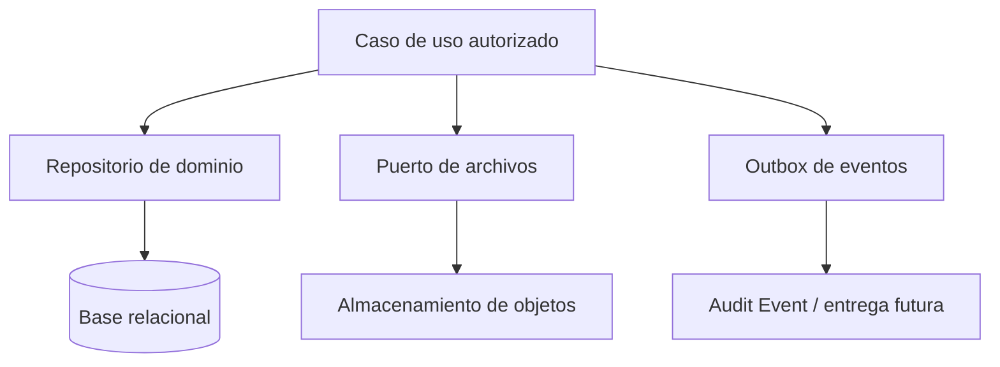

# KYRUMA OS™ — Data Architecture

**Estado:** Propuesta lógica; no hay base de datos ni proveedor seleccionado.

## Persistencia relacional propuesta

Una base relacional gestionada es la opción recomendada por integridad, relaciones, historial y autorización por ámbito. Los repositorios ocultan el ORM/proveedor a los casos de uso.

## Convenciones de modelo

- PK interna UUIDv7/ULID; `publicId`/slug separado, no secuencial y revocable.
- `organization_id` obligatorio en datos de negocio. `workspace_id` obligatorio para recursos de workspace.
- Foreign keys, restricciones de estado y transacciones para conversión Lead→Partner, envío de propuesta y publicación de entregable.
- `created_at`, `updated_at`, `created_by`, `version`; `deleted_at` para soft delete cuando la retención lo permita.
- Índices iniciales: `(organization_id, status)`, `(workspace_id, updated_at DESC)`, claves de slug únicas en su ámbito y claves de idempotencia de eventos.

## Discovery y archivo

- `discovery_template` y `discovery_template_version`: esquema versionado de preguntas.
- `discovery` identifica el proceso de un Partner/Workspace; `discovery_submission` guarda un snapshot de respuestas con `template_version_id`.
- Las respuestas no se migran destructivamente al cambiar preguntas. Las vistas interpretan cada versión o muestran campos retirados de forma segura.
- Archivos: DB solo guarda metadatos, clasificación, propietario, hash y referencia de objeto. Descargas mediante URL firmada de corta duración, después de autorización.

## Migraciones, copias y portabilidad

- Migraciones revisadas, reversibles cuando sea posible y ejecutadas una vez por entorno fuera de peticiones.
- Copias automáticas, pruebas de restauración y RPO/RTO son dependencias del proveedor y del volumen real: **pendientes**.
- Exportación por Organization/Partner con autorización fuerte, registro de auditoría y formato portable; borrado sujeto a retención legal pendiente.
- Búsqueda empieza por campos estructurados e índices relacionales. No incorporar motor de búsqueda externo hasta existir volumen/consulta que lo justifique.

## Datos sensibles

Discovery, notas, propuestas, contactos y archivos se clasifican al menos como confidenciales. Cifrado en tránsito y en reposo se exige al proveedor; cifrado a nivel de campo se evalúa para datos de alta sensibilidad cuando se defina su naturaleza. Los logs guardan IDs y metadatos mínimos, no contenido.
