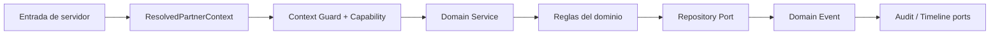

# KYRUMA OS™ — Domain Implementation Guide

## Propósito

Este documento define el patrón obligatorio para convertir una Product Specification aprobada en un dominio funcional de KYRUMA OS™. No implementa ningún dominio ni sustituye una decisión de producto.

Un dominio es dueño de sus reglas, casos de uso, puertos y eventos. Consume la Foundation como infraestructura común; nunca vuelve a resolver identidad, Membership, Partner o Workspace.

## Antes de crear código

Cada dominio requiere una especificación aprobada que establezca, como mínimo:

1. propósito, responsable y límites del dominio;
2. estados, transiciones y reglas de negocio;
3. propietario, ámbito (`Organization`, `Partner`, `Workspace`) y visibilidad;
4. capacidades necesarias por acción;
5. clasificación de datos, retención, exportación y requisitos legales;
6. eventos de dominio, proyecciones de Timeline y registros de Audit esperados;
7. criterios de aceptación y estrategia de rollback.

Sin estos datos el dominio no pasa de diseño. No se infiere una decisión empresarial desde la interfaz ni desde una URL.

## Estructura canónica

```text
src/features/<domain>/
  domain/          tipos, reglas puras, estados, errores y eventos
  application/     casos de uso y servicios que orquestan el dominio
  ports/           contratos de persistencia e integraciones
  adapters/        implementaciones de puertos, solo si están aprobadas
  tests/           pruebas propias del dominio
  index.ts          API pública mínima, si aporta una frontera útil
```

La plantilla física vive en `templates/domain-module/`. Se copia y se completa solo después de aprobar la Product Specification. Los nombres de carpetas usan `kebab-case`; los archivos TypeScript, `camelCase.ts`; los tipos, clases y errores, `PascalCase`.

## Flujo obligatorio de un caso de uso



1. La frontera de servidor obtiene un `ResolvedPartnerContext` de Foundation.
2. El caso de uso llama a `requireContextAccess` con la capacidad y visibilidad declaradas.
3. El Domain Service valida entradas y aplica reglas puras del dominio.
4. La persistencia y las integraciones se invocan únicamente mediante puertos.
5. Tras confirmar el cambio se declara un Domain Event versionado.
6. Audit y Timeline se solicitan mediante sus puertos cuando la especificación lo exige; no son el mismo evento ni sustituyen al evento de dominio.

No se permite acceso directo a bases de datos, proveedores de identidad, almacenamiento del navegador ni resolutores de Partner/Workspace desde un módulo de dominio.

## Integraciones transversales

| Necesidad | Patrón | Regla |
| --- | --- | --- |
| Contexto | `ResolvedPartnerContext` recibido | Nunca resolverlo dentro del dominio. |
| Permisos | `requireContextAccess` + Capability declarada | Comprobar en servidor antes de leer o mutar. |
| Persistencia | Repository Port | La implementación de PostgreSQL será un adaptador futuro. |
| Eventos | Evento de dominio con versión, actor, ámbito y recurso | Diseñar idempotencia antes de consumidores críticos. |
| Audit | Puerto de auditoría independiente | Registrar decisión y actor, sin datos sensibles innecesarios. |
| Timeline | Puerto/proyección explícita | Solo crear una entrada cuando aporte valor de producto. |
| Errores | Errores tipados del dominio | No filtrar detalles internos al cliente. |

Los dominios globales que no requieran Partner Context son una excepción: su especificación debe justificarlo, declarar un ámbito alternativo y recibir aprobación técnica explícita.

## Límites de dependencia

La dirección permitida es:

```text
domain <- application <- adapters / entradas de servidor
                 ^
              ports
```

`domain` no importa React, Next.js, persistencia, red ni Foundation. `application` puede importar tipos y guards públicos de Foundation y los puertos del dominio. `adapters` implementa puertos, pero no alberga reglas de negocio.

## Entregables mínimos por dominio

- Product Specification o RFC aprobado.
- Módulo siguiendo la estructura canónica.
- Matriz de capacidades, contexto y visibilidad.
- Contratos de puertos y eventos.
- Pruebas y fixtures sin datos personales reales.
- Documentación de operación, errores y rollback.
- Checklist de aceptación completado en `DOMAIN_ACCEPTANCE_CHECKLIST.md`.

La creación de un dominio, su publicación o su activación nunca ocurre automáticamente al aprobar esta guía.
