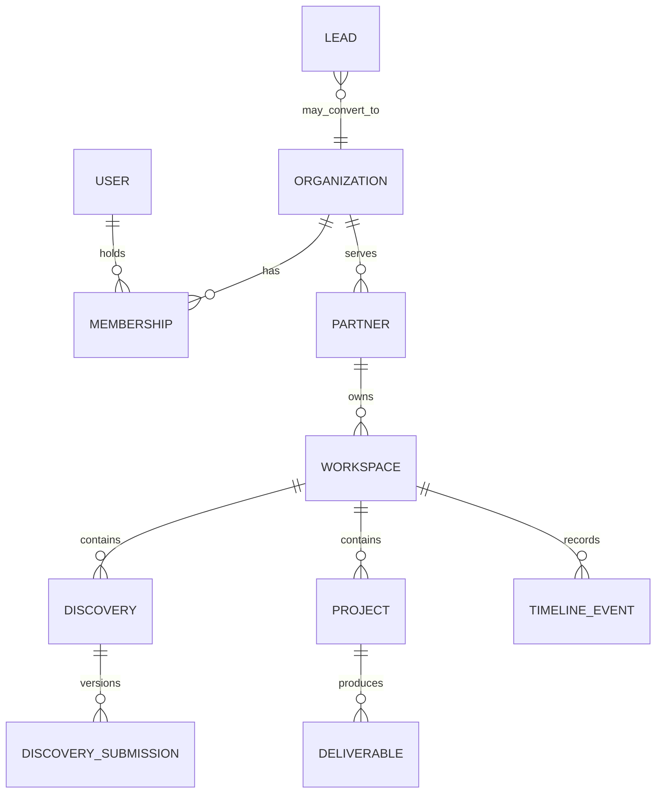

# KYRUMA OS™ — Domain Model

**Estado:** Propuesta. Los identificadores son UUID/ULID internos no adivinables; las URLs públicas usan un slug independiente y revocable.

| Entidad | Propósito y ciclo de vida | Propiedad / visibilidad | Sensibilidad y retención |
| --- | --- | --- | --- |
| Lead | Entrada comercial previa a relación. `NEW → CONTACTED → DISCOVERY_PENDING / DISCOVERY_IN_PROGRESS / DISCOVERY_COMPLETED → QUALIFIED / NOT_QUALIFIED → PROPOSAL_PENDING → CONVERTED / ARCHIVED`. | Interna, asociable a Organization; nunca obtiene acceso por sí mismo. | PII y atribución; retención pendiente de política. |
| Organization | Empresa o entidad legal/comercial. Puede tener varios Leads, Partners y Users. `active / archived`. | Interna; Partners ven solo su propio contexto autorizado. | Datos comerciales; soft delete y exportación. |
| User | Persona autenticable. `invited → active → suspended / revoked`. | Propia; acceso por Membership. | PII, credenciales gestionadas por proveedor; minimización. |
| Membership | Unión User–Organization con scopes opcionales de Partner y Workspace, rol y capacidades. `invited / active / revoked`. | Visible a administradores autorizados. | Evidencia de acceso y auditoría. |
| Partner | Relación comercial y estratégica formalmente aprobada con una Organization. `ONBOARDING / ACTIVE / PAUSED / GROWTH / ALUMNI / TERMINATED`. Tiene `partnerPublicId` inmutable `KYR-XXX`, no usado para autorización. | Interno; personas Partner solo por Membership y Workspace. | Datos de relación y decisiones; no se elimina. |
| Workspace | Entorno digital asociado al Partner. Foundation puede crear uno interno principal, sin forzar uno-a-uno ni activar acceso externo. | Aislado por autorización de recurso. | Límite principal de aislamiento y auditoría. |
| Discovery | Definición o versión del cuestionario. | Partner e interno según etapa; la ruta pública actual se conserva. | Respuestas posiblemente sensibles. |
| Discovery Submission | Captura inmutable por intento/versión. `DRAFT / SUBMITTED / UNDER_REVIEW / REVIEWED / ARCHIVED`; conserva remitente, origen, consentimientos y relación posterior. No se sobrescribe; una corrección crea versión, enmienda o registro adicional. | Internal por defecto; partner ve sus envíos autorizados. | PII y estrategia; retención explícita. |
| Timeline Event | Hecho visible en la línea temporal, derivado de dominio o creado manualmente. | Filtrado por actor y audience. | No incluir secretos ni payloads completos. |
| Meeting | Reunión ligada opcionalmente a Lead, Partner, Workspace o Proposal. `scheduled / completed / cancelled / no_show`. | Participantes autorizados. | Agenda y notas; datos personales. |
| Proposal | Propuesta versionada. `draft / sent / accepted / declined / expired / superseded`. | Interna hasta compartir; partner solo versión publicada. | Comercial y contractual; historial inmutable. |
| Project | Ejecución tras propuesta o acuerdo. `planned / active / on_hold / completed / cancelled`. | Workspace autorizado. | Datos de entrega y seguimiento. |
| Strategy Decision | Decisión con contexto, alternativas, dueño y fecha de revisión. `proposed / decided / superseded`. | Workspace; exposición externa explícita. | Conocimiento estratégico. |
| Task | Trabajo atómico con responsable, estado y fecha. `open / in_progress / blocked / done / cancelled`. | Workspace y miembros autorizados. | Datos operativos. |
| Deliverable | Resultado publicable de un proyecto. `draft / review / published / withdrawn`. | Partner solo cuando publicado. | Propiedad intelectual y versiones. |
| Document | Registro de contenido/archivo con clasificación. `active / archived / deleted`. | ACL de Workspace/recurso. | Puede contener PII, contrato o IP. |
| Asset | Archivo binario y metadatos de almacenamiento. `pending / available / quarantined / deleted`. | Nunca público por defecto; URL firmada y temporal. | Alto riesgo; antivirus/validación futura. |
| Internal Note | Nota interna, no compartible por defecto. `active / archived`. | Solo personal KYRUMA autorizado. | Confidencial; excluida de portal. |
| Notification | Intención y registro de aviso. `queued / sent / failed / read`. | Destinatario y personal autorizado. | Minimizar contenido; reintentos idempotentes. |
| Insight | Interpretación, observación o recomendación manual o futura de Intelligence. `DRAFT / REVIEWED / PUBLISHED / DISMISSED / ARCHIVED`; distingue hechos, inferencias y recomendaciones. | Interno hasta publicación explícita. | Trazabilidad a fuentes; no sustituye evidencia. |
| Audit Event | Registro inmutable de acción sensible. | Administradores/seguridad. | Actor, fecha, recurso y metadatos mínimos; retención legal pendiente. |

## Relaciones y reglas no negociables

- Un User puede pertenecer a varias Organizations; un Organization puede tener múltiples Memberships.
- Foundation recomienda un Partner activo por Organization, sin impedir relaciones históricas; la creación de Partner es siempre una acción interna autorizada y comienza en `ONBOARDING`.
- Partner y Workspace no se fuerzan a uno-a-uno: Foundation puede iniciar uno interno principal, pero el negocio puede requerir workspaces por iniciativa, periodo o proyecto.
- Toda entidad de negocio operativa debe tener `organizationId`; las de workspace además `workspaceId` cuando aplique.
- `createdAt`, `updatedAt`, `createdBy` y `version` son metadatos base. Las entidades auditables añaden `deletedAt` y razón de cambio cuando proceda.
- La visibilidad es explícita: `internal`, `shared`, `partner_private` o `public_link`. Un recurso asociado a Partner no se comparte implícitamente.
- Las respuestas originales y los outputs de Intelligence permanecen separados: un Insight referencia las Submission versionadas que lo sustentan.
