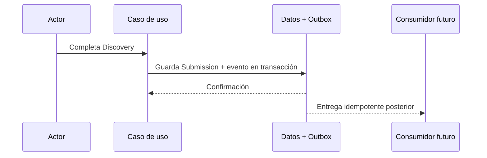

# KYRUMA OS™ — Event Architecture

**Estado:** Propuesta. No se introduce un bus distribuido en esta fase.

## Principios

Un evento de dominio declara un hecho ya confirmado (`DiscoveryCompleted`), con identificador, versión, actor, ámbito, fecha y referencia al recurso. Un evento de analítica describe comportamiento web y permanece sujeto a consentimiento. Nunca se reutiliza un evento de analítica como disparador operativo.



## Envelope mínimo

```text
eventId, eventType, schemaVersion, occurredAt,
organizationId, workspaceId?, actorId?, resourceId,
correlationId, idempotencyKey, data
```

El `data` contiene referencias y atributos mínimos, nunca respuestas completas, archivos ni PII innecesaria. Una futura outbox transaccional evita eventos perdidos sin necesitar mensajería externa al inicio.

| Evento | Productor | Consumidores potenciales | Payload mínimo |
| --- | --- | --- | --- |
| LeadCreated | Acquisition | Timeline, notificación | `leadId`, fuente, estado |
| PartnerCreated | Partners | Timeline, permisos | `partnerId`, `organizationId` |
| DiscoveryStarted | Discovery | Timeline | `discoveryId`, versión |
| DiscoveryCompleted | Discovery | revisión, Intelligence futura | `discoveryId`, `submissionId`, versión |
| DiscoveryReviewed | Discovery | Timeline, partner | `discoveryId`, revisor, resultado |
| MeetingScheduled / Completed | Delivery | Timeline, avisos | `meetingId`, estado, fecha |
| ProposalCreated / Sent / Accepted | Delivery | Timeline, Project | `proposalId`, versión, estado |
| ProjectCreated / Started | Delivery | Timeline, tareas | `projectId`, estado |
| DocumentUploaded | Knowledge | análisis, auditoría | `documentId`, clasificación |
| DeliverablePublished | Delivery | partner, notificación | `deliverableId`, versión |
| InsightGenerated | Intelligence | revisión humana | `insightId`, fuentes, estado |
| NotificationCreated | Platform | adaptador de entrega | `notificationId`, destinatario, tipo |

## Garantías y operación

- Versionado: nombres estables y `schemaVersion`; cambios incompatibles crean una nueva versión/consumidor.
- Idempotencia: productor guarda `idempotencyKey`; consumidor registra `eventId` procesado antes de efectos externos.
- Reintentos: errores transitorios con backoff y límite; fallos definitivos van a revisión operativa, no bucles infinitos.
- Trazabilidad: `correlationId` atraviesa solicitud, evento, audit log y notificación.
- Privacidad: consumidores recuperan datos autorizados desde repositorio si necesitan más contexto; el evento no transporta el contenido completo.
- Analytics actual: `kyruma_*` en `dataLayer` sigue siendo analítica de consentimiento y no entra en la outbox de dominio.
