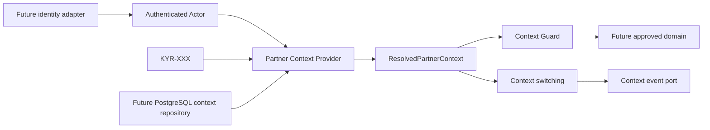

# KYRUMA OS™ — Foundation Readiness Report

**Alcance revisado:** Identity & Permissions + Partner Context
**Estado:** Consolidación completada
**Recomendación final:** **READY WITH CONDITIONS**

## 1. Executive Summary

La Foundation proporciona un núcleo estable y desacoplado para resolver identidad, Membership, Partner, Workspace, capacidades y visibilidad sin afectar la web pública ni KYRUMA Discovery™. La autorización se ejecuta en servidor mediante un evaluador puro; el contexto se resuelve desde un Partner `KYR-XXX`, no desde IDs internos, y el switching invalida explícitamente el contexto anterior.

La base está preparada para que un primer dominio funcional consuma infraestructura común sin reescribirla. No está preparada para persistir datos de negocio o exponer rutas internas hasta seleccionar proveedor de identidad, PostgreSQL y políticas operativas pendientes.

## 2. Estado general de Foundation

| Capacidad | Estado | Evidencia |
| --- | --- | --- |
| Identidad desacoplada | Lista | `IdentityProvider` y `IdentityRepository` son puertos sin SDK concreto. |
| Membership y capacidades | Lista | Roles como agrupaciones, grants/revocations y Membership activa scoped. |
| Autorización de servidor | Lista | `authorize` y `requireAuthorization`; denegación por estado, scope y visibilidad. |
| Partner Context | Lista | Provider por `KYR-XXX`, Membership Resolver y Context Guard. |
| Workspace Context | Lista | Resolver sin modelo uno-a-uno permanente; falla ante ambigüedad. |
| Context Switching | Lista | Nueva resolución, invalidación explícita y evento de cambio. |
| Eventos base | Lista como contrato | Publisher y cinco eventos de contexto sin consumidores de negocio. |
| Persistencia real | No iniciada | PostgreSQL lógico aprobado; proveedor y migraciones pendientes. |
| Login / sesiones reales | No iniciados | Puerto aprobado; proveedor pendiente. |

## 3. Arquitectura consolidada

- Los módulos futuros reciben `ResolvedPartnerContext`; no resuelven Partner, Workspace ni Membership directamente.
- `requireContextAccess` combina contexto, Capability, Membership y Visibility antes de permitir una acción.
- `contextKey` es solo una clave interna de invalidación; no se serializa ni actúa como credencial.
- Timeline, Audit Event y analítica continúan separados de los eventos de contexto.

## 4. Riesgos abiertos

| Riesgo | Nivel | Impacto | Tratamiento |
| --- | --- | --- | --- |
| Proveedor de identidad no seleccionado | Bloqueante | No hay sesión, invitación ni revocación real. | RFC y evaluación de proveedor antes de rutas internas. |
| PostgreSQL/proveedor, región y backup pendientes | Bloqueante | No se pueden persistir entidades operativas de forma segura. | RFC de datos e infraestructura antes de Lead Lifecycle. |
| Matriz granular de capacidades pendiente | Bloqueante para un dominio externo | Puede producir permisos demasiado amplios/restrictivos. | Aprobar matriz del primer dominio antes de implementar sus casos de uso. |
| Retención y tratamiento jurídico | Bloqueante para PII nueva | Riesgo legal y de ciclo de vida de datos. | Política por categoría con asesoramiento jurídico. |
| Publicación de eventos síncrona | Media | Un adaptador futuro defectuoso podría afectar resolución. | Definir semántica de entrega/outbox antes del primer consumidor crítico. |

## 5. Deuda técnica

| Prioridad | Elemento | Impacto / riesgo | Recomendación | Momento |
| --- | --- | --- | --- | --- |
| Crítica | Ninguna identificada | — | — | — |
| Alta | Ninguna interna; identidad y datos reales son dependencias, no deuda | No implementar dominios antes de resolverlas. | Tratar como gates de RFC. | Antes de Lead Lifecycle. |
| Media | Policy de roles declarada en código | Catálogo largo; cambios futuros pueden ser difíciles de revisar. | Extraer a configuración versionada cuando se apruebe la primera matriz de dominio. | Antes de múltiples dominios. |
| Media | Eventos de contexto sin semántica de entrega | Riesgo de acoplar un publicador síncrono a petición. | Definir contrato de errores y outbox cuando exista consumidor crítico. | Antes de notificaciones/Timeline. |
| Media | Sin medición de cobertura porcentual | Las pruebas cubren reglas críticas, no todas las combinaciones. | Añadir cobertura cuando se elija la herramienta de test del producto. | Antes de ampliar autorización. |
| Baja | Runner de Foundation compila a directorio temporal | Añade una configuración de test específica, pero sin dependencia externa. | Mantenerlo hasta adoptar runner único de proyecto. | Cuando exista suite general. |
| Baja | No hay identificador público de Workspace | La selección externa aún no tiene URL/UX definitiva. | Decidirlo antes del Client Portal, no antes. | Antes de portal. |

## 6. Cobertura

Se ejecutan **8 pruebas de Foundation** mediante el runner nativo de Node:

- Membership revocada denegada.
- Aislamiento por Organization.
- Resolución autorizada de Partner, Membership y Workspace.
- Denegación de recursos `internal` para Partner.
- Denegación de Workspace con acceso externo desactivado.
- Rechazo de `KYR-XXX` inválido sin consultar repositorio.
- Selección obligatoria ante múltiples Workspaces sin principal.
- Context Switching con invalidación y evento.

Zonas sin prueba de integración, justificadamente: proveedor de identidad, PostgreSQL, sesiones, Audit Event persistente, rutas internas y UI. No existen todavía por decisión de alcance; deberán tener pruebas de integración en sus RFC respectivos.

## 7. Dependencias pendientes

1. RFC de proveedor de identidad, sesiones, invitaciones y revocación.
2. RFC de PostgreSQL/proveedor, migraciones, región, backup y secretos.
3. Matriz de Capability + Visibility específica para el primer dominio funcional.
4. Política legal de retención, eliminación, exportación y datos restringidos.
5. Definición de Owner de creación de Partner y activación de Workspace.

## 8. Recomendaciones

1. Mantener Foundation congelada salvo correcciones de seguridad o compatibilidad.
2. Elegir el primer dominio funcional solo después de completar los RFC bloqueantes.
3. Conservar el patrón: casos de uso reciben `ResolvedPartnerContext`, repositorios detrás de puertos y guard de servidor obligatorio.
4. No crear selector visual, portal ni rutas `/os` hasta que identidad/sesión real esté aprobada.
5. Añadir consumidores de eventos solo con una semántica de entrega explícita.

## 9. Checklist de inicio de dominios funcionales

| Verificación | Estado |
| --- | --- |
| Identidad desacoplada del proveedor | ✅ |
| Autorización por Capability + Membership | ✅ |
| Partner Context explícito | ✅ |
| Workspace Context multi-workspace compatible | ✅ |
| Membership Context resuelto | ✅ |
| Visibilidad aplicada en guard | ✅ |
| Context events base sin consumidores especulativos | ✅ |
| Documentación y referencias cruzadas consolidadas | ✅ |
| Pruebas críticas de Foundation | ✅ |
| Proveedor de identidad aprobado | ⛔ Pendiente |
| PostgreSQL/proveedor y migraciones aprobados | ⛔ Pendiente |
| Política de datos/retención aprobada | ⛔ Pendiente |
| RFC y autorización del próximo dominio | ⛔ Pendiente |

## 10. Recomendación final

### READY WITH CONDITIONS

Foundation está lista como infraestructura reusable y no requiere rediseño previo para iniciar un dominio. La autorización para iniciar cualquier dominio funcional queda condicionada a cerrar las cuatro dependencias bloqueantes: identidad real, persistencia PostgreSQL, política de datos y RFC/matriz de permisos del dominio elegido. Sin ellas, comenzar Lead Lifecycle, Discovery persistence o cualquier superficie externa introduciría reglas o infraestructura no aprobadas.
