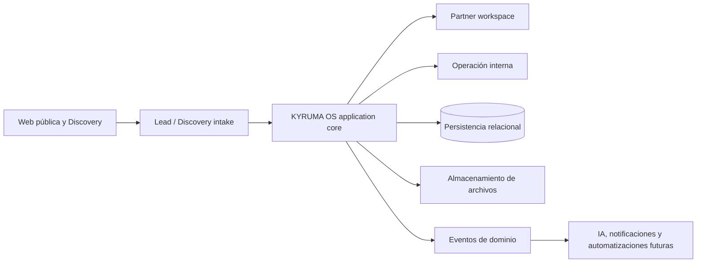

# KYRUMA OS™ — Technical Architecture

**Estado:** Propuesta para revisión ejecutiva
**Alcance:** arquitectura; no implementa funcionalidad operativa.

## Resumen ejecutivo

KYRUMA OS debe convivir inicialmente con la web pública en este repositorio Next.js, como una aplicación interna modular bajo rutas protegidas. La convivencia es adecuada mientras el equipo, el despliegue y los límites de carga sean modestos. No es una decisión irreversible: los dominios deben depender de contratos de aplicación y repositorios de datos, no de páginas públicas ni de proveedores concretos.

La primera frontera es entre **captación pública** (`/`, contacto y Discovery público) y **operación autenticada** (partner, workspaces, proyectos y administración). El Discovery actual permanece compatible en `/workspace`; una futura persistencia traducirá su envío a una `DiscoverySubmission` sin cambiar su experiencia.



## Auditoría del sistema actual

| Elemento | Estado observado | Clasificación | Nota |
| --- | --- | --- | --- |
| Next.js 16 App Router | Rutas públicas y dos route handlers | Mantener | Base adecuada para web y primer backoffice. |
| `src/features/workspace` | Motor de ocho conversaciones, validación y resumen | Reutilizar | Debe separarse de su persistencia local al introducir servidor. |
| `/workspace` | Discovery público, sin identidad | Mantener | Contrato público validado; no reutilizarlo como portal autenticado. |
| `/api/contact`, `/api/brief` | Validación y entrega por correo | Mantener | Son intake transitorio; no son repositorios de datos. |
| `localStorage` | Reanudación del Discovery en navegador | Mantener temporalmente | No es fuente de verdad ni apto para datos operativos. |
| Providers de tema, idioma y motion | Presentación global | Reutilizar | Separar de providers internos de identidad/datos. |
| Consentimiento y Marketing Foundation | Carga condicional por consentimiento | Mantener | Los eventos de analítica no sustituyen eventos de dominio. |
| Resend | Entrega de email directa | Refactorizar más adelante | Encapsular en adaptador de notificaciones cuando haya dominio. |
| Autenticación, base de datos, RBAC, auditoría | Ausentes | Fuera de alcance actual | Requisitos de las primeras fases de implementación. |
| Componentes Workspace antiguos eliminados y ficheros `.DS_Store` | Deuda menor | Retirar más adelante | Limpieza independiente, no parte de esta fase. |

## Límites de dominio recomendados

| Dominio | Responsabilidad | No es responsable de |
| --- | --- | --- |
| Acquisition | Contactos, atribución y conversión de Lead | Proyectos o permisos de partner |
| Identity | Usuarios, sesiones, memberships y capacidades | Perfil de negocio del partner |
| Partner Context | Organización, Partner y Workspace | Renderizado de web pública |
| Discovery | Plantillas, versiones, respuestas y revisión | Inferencias de IA |
| Delivery | Reuniones, propuestas, proyectos, tareas y entregables | Facturación definitiva hasta definir negocio |
| Knowledge | Documentos, assets, notas y decisiones estratégicas | Almacenamiento de sesión |
| Intelligence | Insights derivados y trazables | Fuente de verdad de respuestas |
| Platform | Auditoría, eventos, notificaciones, archivos y observabilidad | Reglas específicas de cada dominio |

## Estructura propuesta

```text
src/
  app/
    (public)/                 # rutas públicas existentes
    workspace/                # Discovery público compatible
    (os)/                     # rutas autenticadas futuras
      os/
      settings/
      admin/
  features/
    acquisition/ identity/ partners/ discovery/ delivery/ knowledge/ intelligence/
  platform/
    auth/ authorization/ data/ events/ files/ observability/ notifications/
  components/
    ui/ platform/             # UI compartida; no lógica de dominio
  lib/                        # utilidades puras y contratos transversales
```

`features` contiene reglas y casos de uso; `platform` encapsula infraestructura. Un dominio solo se crea cuando una fase aprobada lo necesita. Las rutas importan casos de uso, nunca clientes de base de datos directamente.

## Estado, caché, errores y observabilidad

- **Servidor:** fuente de verdad para entidades operativas; lecturas por caso de uso y autorización previa.
- **Cliente:** estado efímero de interfaz; el estado local del Discovery seguirá siendo una optimización recuperable.
- **Caché:** sin caché compartida hasta medir necesidades. Empezar con datos por solicitud y etiquetas/invalidez explícita para vistas agregadas.
- **Errores:** errores de dominio tipados y mensajes seguros; los route handlers no deben filtrar detalles internos.
- **Logging:** logs estructurados con `requestId`, `actorId` pseudonimizado, `workspaceId` y tipo de evento. Nunca respuestas de Discovery, secretos ni archivos en logs.
- **Despliegue:** seguir con Vercel y variables por entorno. Migraciones y tareas de datos deberán ejecutarse fuera de la petición web.

## Component architecture propuesta

Los componentes de plataforma viven en `components/platform` y reciben view models; no llaman repositorios ni deciden permisos. Los contenedores/rutas autorizados preparan datos y traducen errores de dominio. Solo se extraen cuando una fase usa el patrón más de una vez.

| Componente candidato | Responsabilidad y variantes | Estados / accesibilidad |
| --- | --- | --- |
| `WorkspaceLayout`, `Sidebar`, `Topbar`, `PartnerHeader` | Shell autenticado, navegación y contexto visible; variante interna/partner. | Landmark `nav`, ruta activa, menú de teclado y contexto sin datos restringidos. |
| `Timeline`, `ActivityFeed`, `StatusBadge` | Hechos y estados previamente filtrados por servidor. | Vacío, loading, error; texto de estado además de color. |
| `ProgressCard`, `InsightCard`, `RoadmapCard`, `MetricCard` | Resumen de datos con fuente/fecha; Insight muestra estado de revisión. | Skeleton, fuente disponible, no sugerir certeza de IA. |
| `DocumentCard`, `Search` | Metadatos de recurso autorizado y búsqueda scoped. | Tipo/tamaño legibles, foco visible, resultados no enumerables. |
| `Modal`, `Drawer`, `Toast` | Interacción genérica de interfaz. | Trap de foco, Escape, `aria-live`, no usar para decisiones de permiso. |
| `EmptyState`, `ErrorState`, `LoadingState`, `Skeleton` | Estados transversales de vista. | Copy sin revelar recursos no autorizados; opción de reintento segura. |
| `PermissionBoundary` | Frontera visual posterior a la autorización de servidor. | No sustituye el guard del caso de uso; 404/403 según política. |

## Decisiones pendientes de negocio

1. Definición comercial de Partner frente a Organization y cuándo un Lead se convierte en Partner.
2. Modelo de visibilidad del portal: qué puede ver y editar un Partner, un Viewer y una persona externa.
3. Régimen de conservación, eliminación y exportación de datos de clientes.
4. Países, jurisdicción, responsables de tratamiento y requisitos contractuales.
5. Propiedad de archivos, tamaño máximo y coste/retención aceptable.

Estas decisiones bloquean implementación, no esta propuesta.
