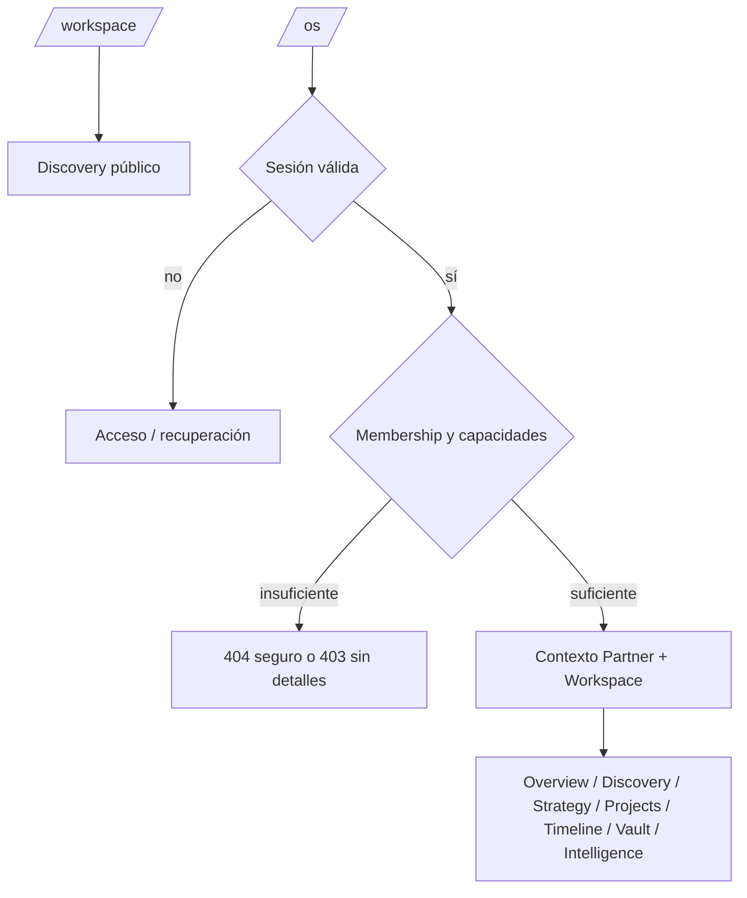

# KYRUMA OS™ — Routing Architecture

**Estado:** Propuesta. Ninguna de estas pantallas se implementa en esta fase.

## Separación de superficies

| Ruta | Audiencia | Autorización | Decisión |
| --- | --- | --- | --- |
| `/`, `/services/*`, `/strategy`, `/contact` | Pública | Ninguna | Se mantiene. |
| `/workspace` | Cliente potencial | Ninguna; validación de API actual | Se mantiene como Discovery público compatible. |
| `/os` | Personal interno | Sesión + capacidad `os.access` | Futuro índice interno; prefijo explícito evita confundirlo con Discovery. |
| `/os/partners/[partnerSlug]/*` | Personal y partner autorizado | Membership + capacidad/recurso | Espacio operativo futuro. |
| `/settings` | Usuario autenticado | Sesión; límites por sección | Preferencias e identidad, no administración global. |
| `/admin` | Super Admin/Admin | `admin.access` | Administración, auditoría y configuración sensible. |

La referencia `/workspace/[partnerId]` no se adopta ahora: colisiona semánticamente con el Discovery público y puede inducir enlaces erróneos. Se recomienda `/os/partners/[partnerSlug]` para operación. Si negocio exige conservar “workspace” como concepto de URL, deberá decidirlo antes de implementación.



## Rutas propuestas después de aprobación

```text
app/
  (public)/workspace/page.tsx                    # Discovery actual, inalterado
  (os)/os/layout.tsx                              # auth + shell interno
  (os)/os/page.tsx                                # selección/búsqueda autorizada
  (os)/os/partners/[partnerSlug]/layout.tsx       # resuelve Partner/Workspace
  (os)/os/partners/[partnerSlug]/page.tsx         # overview
  (os)/os/partners/[partnerSlug]/discovery/page.tsx
  (os)/os/partners/[partnerSlug]/strategy/page.tsx
  (os)/os/partners/[partnerSlug]/projects/page.tsx
  (os)/os/partners/[partnerSlug]/timeline/page.tsx
  (os)/os/partners/[partnerSlug]/vault/page.tsx
  (os)/os/partners/[partnerSlug]/intelligence/page.tsx
  (os)/settings/layout.tsx
  (os)/admin/layout.tsx
```

## Layouts y resolución de contexto

- `PublicLayout`: existente; no introduce providers de plataforma.
- `OsLayout`: sesión, actor, idioma y shell; no carga el Partner antes de necesitarlo.
- `PartnerLayout`: resuelve `partnerSlug → partnerId` dentro de la Organization autorizada, selecciona Workspace activo y pasa un contexto mínimo a hijos.
- Los IDs internos nunca se exponen en URL, correos ni errores. Slugs son únicos por Organization, no globalmente inferibles cuando el producto lo requiera.
- Un recurso compartido con partner requiere un enlace autenticado o token revocable, con vencimiento y audience definidos. No se usarán IDs como secretos.

## Estados de ruta

- `loading.tsx`: skeleton accesible del shell, sin datos sensibles.
- `error.tsx`: mensaje seguro, `requestId`, reintento y logging de error.
- `not-found.tsx`: devolver 404 para recursos no visibles; evita enumeración de Partners/Workspaces.
- Mutaciones por route handler/server action solo tras verificar actor, Organization, Workspace y capacidad.
